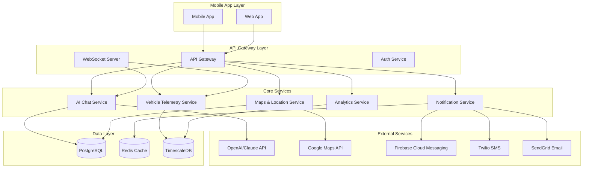

# AIVONITY Advanced Features Design Document

## Overview

This design document outlines the architecture and implementation approach for transforming the AIVONITY Vehicle Assistant into a production-ready, feature-rich platform with advanced AI capabilities, real-time functionality, and comprehensive user experience.

## Architecture

### System Architecture Overview



## Components and Interfaces

### 1. Advanced AI Chat System

#### AI Chat Service Architecture

```typescript
interface AIchatService {
  // Core chat functionality
  sendMessage(
    userId: string,
    message: string,
    context: VehicleContext
  ): Promise<AIResponse>;
  getConversationHistory(
    userId: string,
    limit?: number
  ): Promise<ChatMessage[]>;

  // Voice capabilities
  processVoiceInput(audioData: Blob): Promise<string>;
  generateVoiceResponse(text: string, language: string): Promise<AudioBuffer>;

  // Context management
  updateVehicleContext(userId: string, vehicleData: VehicleData): Promise<void>;
  getPersonalizedRecommendations(userId: string): Promise<Recommendation[]>;
}

interface VehicleContext {
  vehicleId: string;
  currentHealth: HealthScore;
  recentAlerts: Alert[];
  maintenanceHistory: MaintenanceRecord[];
  drivingPatterns: DrivingData;
}
```

#### Implementation Details

- **AI Provider Integration**: OpenAI GPT-4 or Anthropic Claude
- **Context Management**: Redis-based conversation context storage
- **Voice Processing**: Google Speech-to-Text and Text-to-Speech APIs
- **Multi-language Support**: i18n with automatic language detection

### 2. Complete Authentication System

#### Authentication Architecture

```typescript
interface AuthService {
  // Registration and login
  register(
    email: string,
    password: string,
    profile: UserProfile
  ): Promise<AuthResult>;
  login(credentials: LoginCredentials): Promise<AuthResult>;
  socialLogin(provider: "google" | "apple", token: string): Promise<AuthResult>;

  // Security features
  enableBiometric(userId: string, biometricData: BiometricData): Promise<void>;
  resetPassword(email: string): Promise<void>;
  verifyEmail(token: string): Promise<boolean>;

  // Session management
  refreshToken(refreshToken: string): Promise<TokenPair>;
  logout(userId: string, deviceId?: string): Promise<void>;
  logoutAllDevices(userId: string): Promise<void>;
}

interface SecurityFeatures {
  // Multi-factor authentication
  enableMFA(
    userId: string,
    method: "sms" | "email" | "authenticator"
  ): Promise<void>;

  // Device management
  registerDevice(userId: string, deviceInfo: DeviceInfo): Promise<string>;
  getActiveDevices(userId: string): Promise<Device[]>;
  revokeDevice(userId: string, deviceId: string): Promise<void>;
}
```

### 3. Interactive Maps and Location Services

#### Maps Service Architecture

```typescript
interface MapsService {
  // Service center discovery
  findServiceCenters(
    location: Coordinates,
    radius: number,
    filters: ServiceFilters
  ): Promise<ServiceCenter[]>;
  getServiceCenterDetails(centerId: string): Promise<ServiceCenterDetails>;

  // Navigation and routing
  getDirections(from: Coordinates, to: Coordinates): Promise<Route>;
  findServiceCentersOnRoute(route: Route): Promise<ServiceCenter[]>;

  // Location tracking
  getCurrentLocation(): Promise<Coordinates>;
  trackLocationUpdates(callback: (location: Coordinates) => void): void;
}

interface ServiceCenter {
  id: string;
  name: string;
  location: Coordinates;
  services: ServiceType[];
  rating: number;
  reviews: Review[];
  availability: TimeSlot[];
  estimatedWaitTime: number;
}
```

### 4. Real-time Vehicle Monitoring

#### Telemetry Service Architecture

```typescript
interface TelemetryService {
  // Real-time data streaming
  subscribeToVehicleData(vehicleId: string): Observable<TelemetryData>;
  getCurrentVehicleStatus(vehicleId: string): Promise<VehicleStatus>;

  // Alert management
  subscribeToAlerts(userId: string): Observable<Alert>;
  acknowledgeAlert(alertId: string): Promise<void>;

  // Historical data
  getHistoricalData(
    vehicleId: string,
    timeRange: TimeRange
  ): Promise<TelemetryData[]>;
  exportTelemetryData(vehicleId: string, format: "csv" | "json"): Promise<Blob>;
}

interface VehicleStatus {
  isOnline: boolean;
  lastUpdate: Date;
  engineStatus: EngineMetrics;
  batteryLevel: number;
  fuelLevel: number;
  location: Coordinates;
  alerts: Alert[];
}
```

### 5. Advanced Analytics and Reporting

#### Analytics Service Architecture

```typescript
interface AnalyticsService {
  // Performance analytics
  getPerformanceMetrics(
    vehicleId: string,
    period: TimePeriod
  ): Promise<PerformanceMetrics>;
  generateTrendAnalysis(vehicleId: string): Promise<TrendAnalysis>;

  // Predictive analytics
  getPredictiveInsights(vehicleId: string): Promise<PredictiveInsights>;
  getMaintenanceForecasts(vehicleId: string): Promise<MaintenanceForecast[]>;

  // Report generation
  generateReport(vehicleId: string, reportType: ReportType): Promise<Report>;
  exportReport(reportId: string, format: "pdf" | "excel"): Promise<Blob>;
  scheduleReport(userId: string, schedule: ReportSchedule): Promise<void>;
}
```

## Data Models

### Enhanced User Model

```typescript
interface User {
  id: string;
  email: string;
  profile: UserProfile;
  preferences: UserPreferences;
  securitySettings: SecuritySettings;
  devices: Device[];
  createdAt: Date;
  lastLoginAt: Date;
}

interface UserPreferences {
  theme: "light" | "dark" | "auto";
  language: string;
  notifications: NotificationPreferences;
  units: "metric" | "imperial";
  privacy: PrivacySettings;
}
```

### Advanced Vehicle Model

```typescript
interface Vehicle {
  id: string;
  userId: string;
  make: string;
  model: string;
  year: number;
  vin: string;
  odometer: number;
  fuelType: "gasoline" | "diesel" | "electric" | "hybrid";
  specifications: VehicleSpecs;
  maintenanceSchedule: MaintenanceSchedule;
  insuranceInfo: InsuranceInfo;
  registrationInfo: RegistrationInfo;
}
```

### Real-time Telemetry Model

```typescript
interface TelemetryData {
  vehicleId: string;
  timestamp: Date;
  location: Coordinates;
  speed: number;
  engineMetrics: EngineMetrics;
  batteryMetrics: BatteryMetrics;
  fuelMetrics: FuelMetrics;
  diagnosticCodes: DiagnosticCode[];
  environmentalData: EnvironmentalData;
}
```

## Error Handling

### Comprehensive Error Management

```typescript
interface ErrorHandler {
  // Network errors
  handleNetworkError(error: NetworkError): Promise<void>;

  // Authentication errors
  handleAuthError(error: AuthError): Promise<void>;

  // Service errors
  handleServiceError(error: ServiceError): Promise<void>;

  // User-friendly error messages
  getErrorMessage(error: AppError, language: string): string;
}

// Retry mechanisms
interface RetryPolicy {
  maxRetries: number;
  backoffStrategy: "exponential" | "linear" | "fixed";
  retryableErrors: ErrorType[];
}
```

## Testing Strategy

### Testing Pyramid

1. **Unit Tests**: Individual component testing
2. **Integration Tests**: Service integration testing
3. **E2E Tests**: Complete user journey testing
4. **Performance Tests**: Load and stress testing
5. **Security Tests**: Vulnerability and penetration testing

### Test Coverage Requirements

- **Backend Services**: 90% code coverage
- **Mobile App**: 85% code coverage
- **API Endpoints**: 100% endpoint coverage
- **Critical Paths**: 100% coverage for authentication, payments, safety features

## Security Considerations

### Data Protection

- **Encryption**: AES-256 for data at rest, TLS 1.3 for data in transit
- **Key Management**: AWS KMS or Azure Key Vault
- **PII Protection**: Data anonymization and pseudonymization
- **GDPR Compliance**: Right to be forgotten, data portability

### Authentication Security

- **Password Policy**: Strong password requirements
- **Session Management**: Secure JWT with short expiration
- **Biometric Security**: Local biometric data storage only
- **Device Trust**: Device fingerprinting and trust scoring

## Performance Optimization

### Mobile App Performance

- **Lazy Loading**: On-demand feature loading
- **Image Optimization**: WebP format with multiple resolutions
- **Caching Strategy**: Multi-level caching (memory, disk, network)
- **Bundle Optimization**: Code splitting and tree shaking

### Backend Performance

- **Database Optimization**: Query optimization and indexing
- **Caching**: Redis for session and frequently accessed data
- **Load Balancing**: Horizontal scaling with load balancers
- **CDN**: Global content delivery network

## Deployment Strategy

### Infrastructure

- **Containerization**: Docker containers for all services
- **Orchestration**: Kubernetes for container management
- **Cloud Provider**: AWS/Azure/GCP with multi-region deployment
- **Monitoring**: Comprehensive monitoring with Prometheus and Grafana

### CI/CD Pipeline

- **Source Control**: Git with feature branch workflow
- **Build Pipeline**: Automated builds with quality gates
- **Testing**: Automated testing at all levels
- **Deployment**: Blue-green deployment with rollback capability
