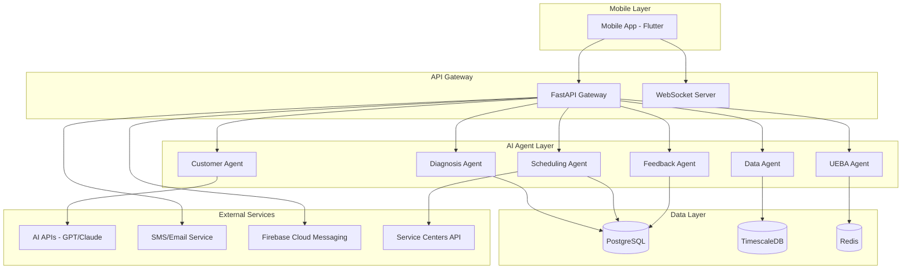

# AIVONITY Design Document

## Overview

AIVONITY is designed as a microservices-based intelligent vehicle assistant ecosystem that combines real-time data processing, machine learning, and conversational AI. The system follows a mobile-first approach with a Flutter frontend and a Python FastAPI backend consisting of specialized AI agents. The architecture emphasizes scalability, real-time performance, and extensibility while maintaining high availability and security.

## Architecture

### High-Level System Architecture



### Microservices Architecture

The backend is organized into specialized AI agents, each responsible for specific domain logic:

1. **Data Agent**: Telemetry ingestion, preprocessing, and anomaly detection
2. **Diagnosis Agent**: ML-based failure prediction and health assessment
3. **Scheduling Agent**: Intelligent service appointment optimization
4. **Customer Agent**: Conversational AI interface for user interactions
5. **Feedback Agent**: Root cause analysis and CAPA report generation
6. **UEBA Agent**: User and Entity Behavior Analytics for security monitoring

### Technology Stack

- **Frontend**: Flutter with Riverpod state management
- **Backend**: Python FastAPI with async/await patterns
- **Database**: PostgreSQL with TimescaleDB extension for time-series data
- **Cache/Pub-Sub**: Redis for real-time communication and caching
- **ML Framework**: scikit-learn, XGBoost, TensorFlow/Keras for LSTM
- **AI Services**: OpenAI GPT-4 or Anthropic Claude for conversational AI
- **Notifications**: Firebase Cloud Messaging, SendGrid for email, Twilio for SMS
- **Containerization**: Docker with Kubernetes for orchestration

## Components and Interfaces

### Mobile Application Components

#### Core Structure

```
lib/
├── core/
│   ├── constants/          # API endpoints, app constants
│   ├── utils/             # Validators, formatters, helpers
│   └── services/          # API client, auth service, notification service
├── data/
│   ├── models/            # Data models (User, Vehicle, Telemetry, etc.)
│   └── repositories/      # API interaction layer
├── features/
│   ├── auth/              # Authentication screens and logic
│   ├── dashboard/         # Vehicle health dashboard
│   ├── telemetry/         # Real-time telemetry visualization
│   ├── chat_ai/           # Conversational AI interface
│   ├── booking/           # Service scheduling interface
│   └── feedback/          # RCA reports and insights
├── providers/             # Riverpod state management
└── routes/               # Navigation and routing
```

#### Key Mobile Components

1. **Dashboard Component**

   - Real-time vehicle health metrics display
   - Alert notifications with severity indicators
   - Quick action buttons for common tasks
   - Interactive charts using fl_chart package

2. **Telemetry Visualization Component**

   - Real-time streaming charts for sensor data
   - Historical trend analysis
   - Anomaly highlighting with contextual information
   - Offline data caching for reliability

3. **AI Chat Component**

   - Text and voice input interfaces using speech_to_text
   - Contextual conversation history
   - Multi-language support with flutter_tts
   - Rich message formatting with vehicle data integration

4. **Booking Management Component**
   - Service center location mapping
   - Calendar integration for appointment scheduling
   - Optimization suggestions display
   - Confirmation and reminder management

### Backend Agent Architecture

#### Base Agent Interface

```python
from abc import ABC, abstractmethod
from typing import Any, Dict, Optional

class BaseAgent(ABC):
    def __init__(self, config: Dict[str, Any]):
        self.config = config
        self.logger = self._setup_logging()

    @abstractmethod
    async def process(self, data: Dict[str, Any]) -> Dict[str, Any]:
        """Main processing method for the agent"""
        pass

    @abstractmethod
    async def health_check(self) -> bool:
        """Health check for the agent"""
        pass
```

#### Data Agent

- **Responsibilities**: Telemetry ingestion, preprocessing, anomaly detection
- **Input**: Raw vehicle sensor data via REST API or streaming
- **Output**: Processed telemetry data, anomaly alerts
- **ML Models**: Isolation Forest for anomaly detection, Statistical Process Control

#### Diagnosis Agent

- **Responsibilities**: Failure prediction, component health assessment
- **Input**: Processed telemetry data, historical maintenance records
- **Output**: Failure probability scores, maintenance recommendations
- **ML Models**: XGBoost for component failure prediction, LSTM for trend analysis

#### Scheduling Agent

- **Responsibilities**: Service appointment optimization
- **Input**: Maintenance recommendations, user preferences, service center availability
- **Output**: Optimized appointment suggestions
- **Optimization**: OR-Tools for constraint satisfaction and optimization

#### Customer Agent

- **Responsibilities**: Conversational AI interface
- **Input**: User queries (text/voice), vehicle context
- **Output**: Contextual responses, action recommendations
- **AI Integration**: OpenAI GPT-4 or Anthropic Claude API

#### Feedback Agent

- **Responsibilities**: Root cause analysis, CAPA generation
- **Input**: Maintenance events, failure patterns
- **Output**: RCA reports, improvement recommendations
- **Analytics**: Pattern recognition, statistical analysis

#### UEBA Agent

- **Responsibilities**: Security monitoring, behavior analysis
- **Input**: System logs, user actions, agent activities
- **Output**: Security alerts, behavior anomaly reports
- **Detection**: Behavioral pattern analysis, threshold-based alerting

### API Interface Design

#### REST API Endpoints

```python
# Authentication
POST /api/v1/auth/login
POST /api/v1/auth/register
POST /api/v1/auth/refresh

# Telemetry
POST /api/v1/telemetry/ingest
GET /api/v1/telemetry/vehicle/{vehicle_id}
GET /api/v1/telemetry/alerts/{vehicle_id}

# Predictions
GET /api/v1/predictions/vehicle/{vehicle_id}
POST /api/v1/predictions/request

# Booking
GET /api/v1/booking/availability
POST /api/v1/booking/schedule
PUT /api/v1/booking/{booking_id}

# Chat
POST /api/v1/chat/message
GET /api/v1/chat/history/{user_id}
POST /api/v1/chat/voice

# Feedback
GET /api/v1/feedback/rca/{vehicle_id}
POST /api/v1/feedback/maintenance-event
```

#### WebSocket Interface

```python
# Real-time telemetry streaming
/ws/telemetry/{vehicle_id}

# Live chat interface
/ws/chat/{user_id}

# Alert notifications
/ws/alerts/{user_id}
```

## Data Models

### Core Data Models

#### User Model

```python
class User(BaseModel):
    id: UUID
    email: str
    phone: Optional[str]
    name: str
    preferences: Dict[str, Any]
    created_at: datetime
    updated_at: datetime
```

#### Vehicle Model

```python
class Vehicle(BaseModel):
    id: UUID
    user_id: UUID
    make: str
    model: str
    year: int
    vin: str
    mileage: int
    registration_date: datetime
    last_service_date: Optional[datetime]
    health_score: float
    created_at: datetime
    updated_at: datetime
```

#### Telemetry Model

```python
class TelemetryData(BaseModel):
    id: UUID
    vehicle_id: UUID
    timestamp: datetime
    sensor_data: Dict[str, float]  # Engine temp, oil pressure, etc.
    location: Optional[Dict[str, float]]  # GPS coordinates
    anomaly_score: Optional[float]
    processed: bool = False
```

#### Prediction Model

```python
class MaintenancePrediction(BaseModel):
    id: UUID
    vehicle_id: UUID
    component: str
    failure_probability: float
    confidence_score: float
    recommended_action: str
    timeframe_days: int
    created_at: datetime
    status: str  # pending, acknowledged, completed
```

#### Booking Model

```python
class ServiceBooking(BaseModel):
    id: UUID
    user_id: UUID
    vehicle_id: UUID
    service_center_id: UUID
    appointment_datetime: datetime
    service_type: str
    estimated_duration: int
    status: str  # scheduled, confirmed, completed, cancelled
    notes: Optional[str]
    created_at: datetime
```

### Database Schema Design

#### TimescaleDB Hypertables

```sql
-- Telemetry data optimized for time-series queries
CREATE TABLE telemetry_data (
    id UUID PRIMARY KEY,
    vehicle_id UUID NOT NULL,
    timestamp TIMESTAMPTZ NOT NULL,
    sensor_data JSONB NOT NULL,
    location JSONB,
    anomaly_score FLOAT,
    processed BOOLEAN DEFAULT FALSE
);

-- Convert to hypertable for time-series optimization
SELECT create_hypertable('telemetry_data', 'timestamp');

-- Create indexes for efficient querying
CREATE INDEX idx_telemetry_vehicle_time ON telemetry_data (vehicle_id, timestamp DESC);
CREATE INDEX idx_telemetry_anomaly ON telemetry_data (anomaly_score) WHERE anomaly_score > 0.7;
```

#### PostgreSQL Relational Tables

```sql
-- Users table
CREATE TABLE users (
    id UUID PRIMARY KEY DEFAULT gen_random_uuid(),
    email VARCHAR(255) UNIQUE NOT NULL,
    phone VARCHAR(20),
    name VARCHAR(255) NOT NULL,
    preferences JSONB DEFAULT '{}',
    created_at TIMESTAMPTZ DEFAULT NOW(),
    updated_at TIMESTAMPTZ DEFAULT NOW()
);

-- Vehicles table
CREATE TABLE vehicles (
    id UUID PRIMARY KEY DEFAULT gen_random_uuid(),
    user_id UUID REFERENCES users(id) ON DELETE CASCADE,
    make VARCHAR(100) NOT NULL,
    model VARCHAR(100) NOT NULL,
    year INTEGER NOT NULL,
    vin VARCHAR(17) UNIQUE NOT NULL,
    mileage INTEGER DEFAULT 0,
    registration_date DATE,
    last_service_date DATE,
    health_score FLOAT DEFAULT 1.0,
    created_at TIMESTAMPTZ DEFAULT NOW(),
    updated_at TIMESTAMPTZ DEFAULT NOW()
);
```

## Error Handling

### Error Classification and Response Strategy

#### Client Errors (4xx)

- **400 Bad Request**: Invalid input data, malformed requests
- **401 Unauthorized**: Authentication failures, expired tokens
- **403 Forbidden**: Insufficient permissions, rate limiting
- **404 Not Found**: Resource not found, invalid endpoints
- **429 Too Many Requests**: Rate limiting, quota exceeded

#### Server Errors (5xx)

- **500 Internal Server Error**: Unhandled exceptions, system failures
- **502 Bad Gateway**: External service failures, AI API timeouts
- **503 Service Unavailable**: Temporary overload, maintenance mode
- **504 Gateway Timeout**: Long-running operations, ML model timeouts

### Error Handling Implementation

#### Backend Error Handling

```python
from fastapi import HTTPException, Request
from fastapi.responses import JSONResponse
import logging

class AIVONITYException(Exception):
    def __init__(self, message: str, error_code: str, status_code: int = 500):
        self.message = message
        self.error_code = error_code
        self.status_code = status_code

@app.exception_handler(AIVONITYException)
async def aivonity_exception_handler(request: Request, exc: AIVONITYException):
    logger.error(f"AIVONITY Error: {exc.error_code} - {exc.message}")
    return JSONResponse(
        status_code=exc.status_code,
        content={
            "error": {
                "code": exc.error_code,
                "message": exc.message,
                "timestamp": datetime.utcnow().isoformat()
            }
        }
    )
```

#### Mobile Error Handling

```dart
class ErrorHandler {
  static void handleApiError(DioError error) {
    switch (error.response?.statusCode) {
      case 401:
        // Handle authentication errors
        AuthService.logout();
        NavigationService.navigateToLogin();
        break;
      case 429:
        // Handle rate limiting
        showRateLimitDialog();
        break;
      case 500:
        // Handle server errors
        showServerErrorDialog();
        break;
      default:
        showGenericErrorDialog(error.message);
    }
  }
}
```

### Graceful Degradation Strategy

1. **Offline Mode**: Cache critical data locally for offline access
2. **Fallback Services**: Use backup AI providers if primary service fails
3. **Circuit Breaker**: Temporarily disable failing services to prevent cascading failures
4. **Retry Logic**: Implement exponential backoff for transient failures
5. **Health Checks**: Continuous monitoring of service health with automatic recovery

## Testing Strategy

### Testing Pyramid Approach

#### Unit Tests (70%)

- **Backend**: Test individual agent functions, data models, utility functions
- **Frontend**: Test widgets, state management, utility functions
- **ML Models**: Test model accuracy, feature engineering, prediction logic

#### Integration Tests (20%)

- **API Integration**: Test end-to-end API workflows
- **Database Integration**: Test data persistence and retrieval
- **External Service Integration**: Test AI API calls, notification services
- **Real-time Communication**: Test WebSocket connections and messaging

#### End-to-End Tests (10%)

- **User Journey Tests**: Complete user workflows from mobile app
- **Performance Tests**: Load testing, stress testing, scalability testing
- **Security Tests**: Authentication, authorization, data protection

### Testing Implementation

#### Backend Testing Framework

```python
import pytest
from fastapi.testclient import TestClient
from unittest.mock import Mock, patch

class TestDataAgent:
    @pytest.fixture
    def mock_telemetry_data(self):
        return {
            "vehicle_id": "test-vehicle-id",
            "timestamp": "2024-01-01T00:00:00Z",
            "sensor_data": {
                "engine_temp": 85.5,
                "oil_pressure": 45.2
            }
        }

    async def test_process_telemetry_success(self, mock_telemetry_data):
        agent = DataAgent(config={})
        result = await agent.process(mock_telemetry_data)
        assert result["status"] == "success"
        assert "anomaly_score" in result

    @patch('external_service.ai_api_call')
    async def test_anomaly_detection(self, mock_ai_call, mock_telemetry_data):
        mock_ai_call.return_value = {"anomaly_score": 0.8}
        agent = DataAgent(config={})
        result = await agent.process(mock_telemetry_data)
        assert result["anomaly_detected"] == True
```

#### Frontend Testing Framework

```dart
import 'package:flutter_test/flutter_test.dart';
import 'package:mockito/mockito.dart';

class MockApiService extends Mock implements ApiService {}

void main() {
  group('Dashboard Widget Tests', () {
    late MockApiService mockApiService;

    setUp(() {
      mockApiService = MockApiService();
    });

    testWidgets('displays vehicle health metrics', (WidgetTester tester) async {
      when(mockApiService.getVehicleHealth(any))
          .thenAnswer((_) async => VehicleHealth(score: 0.85));

      await tester.pumpWidget(
        MaterialApp(
          home: DashboardScreen(apiService: mockApiService),
        ),
      );

      expect(find.text('Health Score: 85%'), findsOneWidget);
    });
  });
}
```

### Performance Testing

#### Load Testing Scenarios

1. **Telemetry Ingestion**: 10,000 concurrent vehicles sending data every 30 seconds
2. **AI Chat**: 1,000 concurrent users having conversations
3. **Prediction Requests**: 500 concurrent ML inference requests
4. **Mobile App Usage**: 5,000 concurrent mobile users browsing dashboards

#### Performance Metrics

- **Response Time**: < 3 seconds for critical operations
- **Throughput**: Handle 100,000 telemetry messages per minute
- **Availability**: 99.9% uptime with graceful degradation
- **Scalability**: Auto-scale based on load with Kubernetes HPA

### Security Testing

#### Security Test Categories

1. **Authentication Testing**: JWT token validation, session management
2. **Authorization Testing**: Role-based access control, data isolation
3. **Input Validation**: SQL injection, XSS prevention, data sanitization
4. **API Security**: Rate limiting, CORS configuration, HTTPS enforcement
5. **Data Protection**: Encryption at rest and in transit, PII handling

#### Automated Security Scanning

- **SAST**: Static code analysis with SonarQube
- **DAST**: Dynamic application security testing with OWASP ZAP
- **Dependency Scanning**: Vulnerability scanning with Snyk
- **Container Scanning**: Docker image security with Trivy

This comprehensive design provides a solid foundation for implementing the AIVONITY system with proper separation of concerns, scalability, and maintainability while addressing all the specified requirements.
